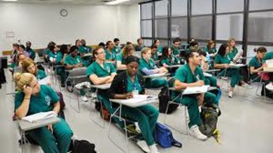

[Melissa Thompson.jpg)](#page-top)
* [About](#about) * [Experience](#experience) * [Education](#education) * [Portfolio](#portfolio)
# Melissa Thompson
Sociology Major��
I am currently a student at University Riverside California. I will be graduating in the summer of 2020 with my bachelor’s degree in Sociology. I plan going straight into nursing school and eventually doing social work in a hospital. I am thirty years old and a community college transfer. The transfer processes was one of my life greatest accomplishments thus far. My academic career has been nothing short of a struggle. I spent ten years on and off in community college trying to figure out what I wanted out of my scholastic journey and why it was so hard for me. As a child I was diagnosed with dyslexia and as a young adult I attempted going through college denying the fact that I learned differently. That resulted in me to dropping classes, getting on academic probation, which in turn resulted in a paralyzing fear of failing educationally. Today I am a mature adult who knows that getting my degree is life changing and something I need to in order to succeed. I have taken my learning disability and made it work for me. Dyslexia has been a gift, showing me to slow down, acknowledge what I don’t understand and appreciate my time learning about the task at hand. I am first generation high school graduate and having the opportunity to surpass that with a college degree is something people in my family use to dream about. Today that dream is a possibly and I am making that a reality at University Riverside California.
* * *
## Experience
### Office Management
[Kimbowt Inc.](https://www.mapquest.com/us/california/kimbowt-inc-420296249)
• Data Control • Supply Management • Quickbooks Input
April 2016 - Present
### Receptionist
[SOS Electric](https://www.yelp.com/biz/sos-electric-chino-hills)
• Anwser Phones • Take Messages • Stock Supplies
July 2008 - April 2016
### Religious Education Teacher
[Saint Catherines of Alexandria](https://www.stcofa.net/)
• Taught basic religious knowledge to high school students • Creat lesson plans for fellow teachers • Go on weekend retreats withe over 70 teens are in my sole care
September 2009 - Present
* * *
## Education
### University California Riverside
Bachelors Of Arts
Bachelors in Sociology
August 2018 - Currently Enrolled
### Riverside Community College
Accociates Of Arts
Associates in Sociology
September 2018
* * *
## Portfolio
  
* * *
© document.write(new Date().getFullYear()); Melissa Thompson

